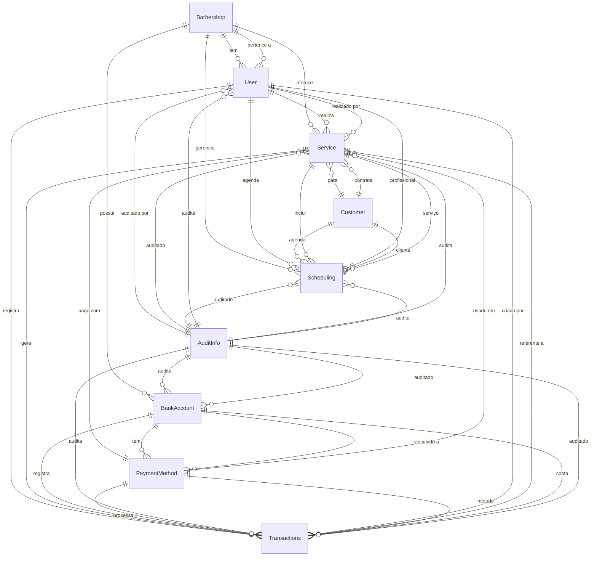

# 🗄️ Database Schema

Este documento detalha o schema do banco de dados do BarberApp, incluindo modelos, relacionamentos e diagramas.

---

## 📋 Índice

- [Visão Geral](#visão-geral)
- [Diagrama ER](#diagrama-er)
- [Modelos](#modelos)
- [Relacionamentos](#relacionamentos)
- [Índices e Performance](#índices-e-performance)
- [Migrations](#migrations)

---

## 🔍 Visão Geral

O BarberApp utiliza **MongoDB** como banco de dados, gerenciado através do **Prisma ORM**. O schema é composto por 11 models principais que representam toda a estrutura de dados do sistema.

### Tecnologias

- **Database**: MongoDB 6.15
- **ORM**: Prisma 6.9
- **Provider**: MongoDB Atlas (Cloud)

### Estatísticas

- **Total de Models**: 11
- **Collections**: 11
- **Relacionamentos**: 32
- **Enums**: 1 (SchedulingStatus)

---

## 📊 Diagrama ER (Entity-Relationship)



---

## 📦 Modelos

### 1. Barbershop

Representa a barbearia/estabelecimento.

```prisma
model Barbershop {
  id           String        @id @default(auto()) @map("_id") @db.ObjectId
  openAt       String?       // Horário de abertura (ex: "08:00")
  closeAt      String?       // Horário de fechamento (ex: "20:00")
  name         String?       // Nome da barbearia
  address      String?       // Endereço completo
  phone        String?       // Telefone de contato
  email        String?       // Email de contato
  description  String?       // Descrição/Bio
  
  // Relacionamentos
  services     Service[]
  users        User[]
  bankAccounts BankAccount[]
  scheduling   Scheduling[]
}
```

**Campos Principais**:
- `openAt`, `closeAt`: Definem horário de funcionamento
- `name`, `address`: Informações básicas
- `email`, `phone`: Contatos

**Relacionamentos**:
- `1:N` com User (vários profissionais)
- `1:N` com Service (vários serviços)
- `1:N` com BankAccount (várias contas)
- `1:N` com Scheduling (vários agendamentos)

---

### 2. User

Representa os profissionais/usuários do sistema.

```prisma
model User {
  id             String         @id @default(auto()) @map("_id") @db.ObjectId
  code           String         @unique  // Código único do usuário
  phone          String?        // Telefone
  notifications  Boolean        @default(false)  // Receber notificações
  isRoot         Boolean        @default(false)  // Super admin
  active         Boolean        @default(true)   // Usuário ativo
  email          String         @unique
  login          String         @unique  // Username para login
  name           String         // Nome completo
  password       String         // Hash da senha
  profileImgLink String?        // URL da foto de perfil
  profileType    String         @default("admin")  // admin, barber, etc
  breakAt        String?        // Horário início do intervalo
  breakEndAt     String?        // Horário fim do intervalo
  
  // Relacionamentos
  services       Service[]
  transactions   Transactions[]
  scheduling     Scheduling[]
  barbershopId   String?        @db.ObjectId
  barbershop     Barbershop?    @relation(fields: [barbershopId], references: [id])
  auditInfoId    String?        @db.ObjectId
  auditInfo      AuditInfo?     @relation(fields: [auditInfoId], references: [id])
}
```

**Campos Únicos**:
- `code`: Código interno (ex: "USR001")
- `email`: Email único
- `login`: Username único

**Flags Importantes**:
- `isRoot`: Identifica super administradores
- `active`: Soft delete (desativar sem deletar)
- `notifications`: Preferência de notificações

**Horário de Trabalho**:
- `breakAt`, `breakEndAt`: Intervalo diário (ex: "12:00" - "13:00")

---

### 3. Customer

Representa os clientes da barbearia.

```prisma
model Customer {
  id         String       @id @default(auto()) @map("_id") @db.ObjectId
  code       String       @unique  // Código único do cliente
  name       String       // Nome completo
  email      String?      // Email (opcional)
  phone      String       // Telefone (obrigatório)
  
  // Relacionamentos
  services   Service[]
  scheduling Scheduling[]
}
```

**Campos Obrigatórios**:
- `name`: Nome do cliente
- `phone`: Principal forma de contato
- `code`: Identificador único

**Uso**:
- Cadastro simplificado (apenas nome e telefone)
- Email opcional para notificações futuras

---

### 4. Service

Representa um serviço realizado (transação de serviço).

```prisma
model Service {
  id              String         @id @default(auto()) @map("_id") @db.ObjectId
  code            String         @unique  // Código único do serviço
  value           Float          // Valor final cobrado
  servicesValue   Float?         // Valor original dos serviços
  discount        Float          @default(0)  // Desconto aplicado
  servicesTypes   Json           // Tipos de serviços realizados
  createdAt       DateTime       @default(now())
  
  // Relacionamentos
  userId          String         @db.ObjectId
  user            User           @relation(fields: [userId], references: [id])
  paymentMethodId String         @db.ObjectId
  paymentMethod   PaymentMethod  @relation(fields: [paymentMethodId], references: [id])
  customerId      String?        @db.ObjectId
  customer        Customer?      @relation(fields: [customerId], references: [id])
  barbershopId    String?        @db.ObjectId
  barbershop      Barbershop?    @relation(fields: [barbershopId], references: [id])
  auditInfoId     String?        @db.ObjectId
  auditInfo       AuditInfo?     @relation(fields: [auditInfoId], references: [id])
  
  transactions    Transactions[]
  scheduling      Scheduling[]
}
```

**Lógica de Precificação**:
- `servicesValue`: Soma dos valores base
- `discount`: Desconto em reais
- `value`: Valor final (`servicesValue - discount`)

**servicesTypes (JSON)**:
```json
[
  { "name": "Corte Masculino", "value": 35.00 },
  { "name": "Barba", "value": 25.00 }
]
```

---

### 5. Scheduling

Representa os agendamentos de serviços.

```prisma
enum SchedulingStatus {
  pendente
  atendido
  cancelado
  agendado
}

model Scheduling {
  id            String           @id @default(auto()) @map("_id") @db.ObjectId
  dateTime      DateTime         @unique  // Data e hora juntos (para unicidade)
  date          String           // Data em string (ex: "2025-01-15")
  time          String           // Hora em string (ex: "14:30")
  description   String?          // Observações
  servicesTypes Json?            // Serviços planejados
  status        SchedulingStatus @default(agendado)
  wasAttended   Boolean          @default(false)  // Se foi atendido
  
  // Relacionamentos
  userId        String           @db.ObjectId
  user          User             @relation(fields: [userId], references: [id])
  serviceId     String?          @db.ObjectId
  service       Service?         @relation(fields: [serviceId], references: [id])
  customerId    String?          @db.ObjectId
  customer      Customer?        @relation(fields: [customerId], references: [id])
  barbershopId  String?          @db.ObjectId
  barbershop    Barbershop?      @relation(fields: [barbershopId], references: [id])
  auditInfoId   String?          @db.ObjectId
  auditInfo     AuditInfo?       @relation(fields: [auditInfoId], references: [id])
}
```

**Status do Agendamento**:
- `agendado`: Confirmado mas não atendido
- `pendente`: Aguardando confirmação
- `atendido`: Serviço realizado
- `cancelado`: Cancelado

**Campos Importantes**:
- `dateTime`: Único por profissional (evita conflitos)
- `date` + `time`: Separados para queries e display
- `wasAttended`: Flag para marcar como concluído

---

### 6. Transactions

Representa todas as transações financeiras (entradas e saídas).

```prisma
model Transactions {
  id              String        @id @default(auto()) @map("_id") @db.ObjectId
  description     String        // Descrição da transação
  value           Float         // Valor (positivo ou negativo)
  date            DateTime      @default(now())  // Data da transação
  category        String        // Categoria (Serviço, Despesa, etc)
  type            String        // "entrada" ou "saida"
  
  // Relacionamentos
  serviceId       String?       @db.ObjectId
  service         Service?      @relation(fields: [serviceId], references: [id], onDelete: Cascade)
  paymentMethodId String        @db.ObjectId
  paymentMethod   PaymentMethod @relation(fields: [paymentMethodId], references: [id])
  userId          String        @db.ObjectId
  user            User          @relation(fields: [userId], references: [id])
  bankAccountId   String?       @db.ObjectId
  bankAccount     BankAccount?  @relation(fields: [bankAccountId], references: [id])
  auditInfoId     String?       @db.ObjectId
  auditInfo       AuditInfo?    @relation(fields: [auditInfoId], references: [id])
}
```

**Tipos de Transação**:
- `entrada`: Receitas (serviços, outras entradas)
- `saida`: Despesas (aluguel, produtos, etc)

**Categorias Comuns**:
- "Serviço" (vinculado a Service)
- "Despesa Fixa" (aluguel, contas)
- "Compra de Material"
- "Comissão"

**Cascade Delete**:
- Se um Service for deletado, suas transações também são deletadas

---

### 7. PaymentMethod

Métodos de pagamento disponíveis.

```prisma
model PaymentMethod {
  id           String         @id @default(auto()) @map("_id") @db.ObjectId
  name         String         // Nome (ex: "Dinheiro", "PIX", "Cartão")
  
  // Relacionamentos
  bankId       String         @db.ObjectId
  bankAccount  BankAccount    @relation(fields: [bankId], references: [id])
  services     Service[]
  transactions Transactions[]
}
```

**Exemplos**:
- Dinheiro → Vinculado à "Caixa"
- PIX → Vinculado à "Conta Corrente"
- Cartão de Débito → Vinculado à "Conta Digital"

---

### 8. BankAccount

Contas bancárias e caixas.

```prisma
model BankAccount {
  id             String          @id @default(auto()) @map("_id") @db.ObjectId
  bankName       String          // Nome (ex: "Nubank", "Caixa", "Itaú")
  initialValue   Float           @default(0)  // Saldo inicial
  agency         String?         // Agência
  accountNumber  String?         // Número da conta
  accountType    String?         // Tipo (Corrente, Poupança, etc)
  accountOwner   String?         // Titular
  
  // Relacionamentos
  paymentMethods PaymentMethod[]
  transactions   Transactions[]
  barbershopId   String?         @db.ObjectId
  barbershop     Barbershop?     @relation(fields: [barbershopId], references: [id])
  auditInfoId    String?         @db.ObjectId
  auditInfo      AuditInfo?      @relation(fields: [auditInfoId], references: [id])
}
```

**Uso**:
- Representa contas bancárias reais
- Pode representar "Caixa" para dinheiro físico
- `initialValue`: Saldo ao criar a conta

---

### 9. AuditInfo

Informações de auditoria (quem criou/atualizou e quando).

```prisma
model AuditInfo {
  id        String   @id @default(auto()) @map("_id") @db.ObjectId
  createdAt DateTime @default(now())
  updatedAt DateTime @updatedAt
  createdBy String?  // ID do usuário que criou
  updatedBy String?  // ID do usuário que atualizou
  
  // Relacionamentos inversos
  services     Service[]
  users        User[]
  bankAccounts BankAccount[]
  schedulings  Scheduling[]
  transactions Transactions[]
}
```

**Campos Automáticos**:
- `createdAt`: Preenchido automaticamente na criação
- `updatedAt`: Atualizado automaticamente em cada update

**Uso Planejado**:
- Rastreabilidade de mudanças
- Compliance e auditoria
- Histórico de alterações

---

### 10. ServicesTypes

Catálogo de tipos de serviços oferecidos.

```prisma
model ServicesTypes {
  id    String @id @default(auto()) @map("_id") @db.ObjectId
  name  String  // Nome do serviço (ex: "Corte Masculino")
  value Float   // Valor padrão
}
```

**Exemplos**:
```json
{ "name": "Corte Masculino", "value": 35.00 }
{ "name": "Corte Feminino", "value": 50.00 }
{ "name": "Barba", "value": 25.00 }
{ "name": "Sobrancelha", "value": 15.00 }
{ "name": "Luzes", "value": 150.00 }
```

---

### 11. Counters

Sistema de contadores para gerar códigos sequenciais.

```prisma
model Counters {
  id    String @id @map("_id")  // Nome do counter (ex: "user", "customer")
  count Int                      // Próximo número disponível
}
```

**Uso**:
```typescript
// Gerar próximo código de cliente
const counter = await prisma.counters.upsert({
  where: { id: 'customer' },
  update: { count: { increment: 1 } },
  create: { id: 'customer', count: 1 }
});

const code = `CLI${String(counter.count).padStart(4, '0')}`;
// Resultado: "CLI0001", "CLI0002", etc.
```

---

## 🔗 Relacionamentos Detalhados

### Relacionamentos 1:N (One-to-Many)

| Parent | Child | Descrição |
|--------|-------|-----------|
| Barbershop | User | Uma barbearia tem vários profissionais |
| Barbershop | Service | Uma barbearia oferece vários serviços |
| Barbershop | BankAccount | Uma barbearia tem várias contas |
| User | Service | Um profissional realiza vários serviços |
| User | Scheduling | Um profissional tem vários agendamentos |
| Customer | Service | Um cliente contrata vários serviços |
| Customer | Scheduling | Um cliente faz vários agendamentos |
| BankAccount | PaymentMethod | Uma conta tem vários métodos de pagamento |
| PaymentMethod | Service | Um método é usado em vários serviços |

### Relacionamentos Opcionais

Alguns relacionamentos são opcionais (`?`), permitindo flexibilidade:

- `Service.customerId?`: Serviço pode ser sem cliente registrado
- `Scheduling.serviceId?`: Agendamento pode não ter serviço vinculado ainda
- `Transactions.serviceId?`: Transação pode não ser de serviço

---

## ⚡ Índices e Performance

### Índices Únicos

```prisma
@@unique([dateTime])  // Scheduling
@@unique([code])      // User, Customer, Service
@@unique([email])     // User
@@unique([login])     // User
```

### Índices Compostos (Recomendados)

```prisma
// Adicionar no schema para melhor performance
@@index([userId, date])           // Scheduling - buscar agendamentos por profissional e data
@@index([date, type])             // Transactions - filtrar por data e tipo
@@index([barbershopId, active])   // User - buscar usuários ativos de uma barbearia
```

### Queries Otimizadas

```typescript
// ✅ BOM - Usar select para reduzir payload
const users = await prisma.user.findMany({
  select: {
    id: true,
    name: true,
    email: true,
  },
  where: { active: true }
});

// ✅ BOM - Usar include apenas quando necessário
const scheduling = await prisma.scheduling.findUnique({
  where: { id },
  include: {
    user: { select: { name: true } },
    customer: { select: { name: true, phone: true } }
  }
});

// ❌ RUIM - Buscar tudo sem filtro
const allData = await prisma.scheduling.findMany({
  include: { user: true, customer: true, service: true }
});
```

---

## 🔄 Migrations

### Comandos Principais

```bash
# Gerar client Prisma após mudanças no schema
npx prisma generate

# Criar migration (apenas se usar SQL)
npx prisma migrate dev --name descricao-da-mudanca

# Push schema para MongoDB (sem migrations)
npx prisma db push

# Abrir Prisma Studio (GUI do banco)
npx prisma studio
```

### Workflow de Mudanças

1. Editar `prisma/schema.prisma`
2. Executar `npx prisma db push` (MongoDB)
3. Executar `npx prisma generate` (atualizar client)
4. Testar em desenvolvimento
5. Commitar mudanças

---

## 📈 Estatísticas do Schema

### Campos por Model

| Model | Total de Campos | Relacionamentos | Campos Únicos |
|-------|-----------------|-----------------|---------------|
| Barbershop | 13 | 4 | 0 |
| User | 18 | 5 | 3 |
| Customer | 5 | 2 | 1 |
| Service | 14 | 7 | 1 |
| Scheduling | 14 | 5 | 1 |
| Transactions | 11 | 5 | 0 |
| PaymentMethod | 4 | 3 | 0 |
| BankAccount | 11 | 4 | 0 |
| AuditInfo | 6 | 5 | 0 |
| ServicesTypes | 3 | 0 | 0 |
| Counters | 2 | 0 | 0 |

---

## 🛡️ Validações e Constraints

### Validações no Schema

```prisma
// Valores default
active   Boolean @default(true)
status   SchedulingStatus @default(agendado)
discount Float @default(0)

// Campos obrigatórios vs opcionais
email   String?  // Opcional
name    String   // Obrigatório

// Update automático
updatedAt DateTime @updatedAt
```

### Validações na Aplicação (Zod)

```typescript
import { z } from 'zod';

const createUserSchema = z.object({
  name: z.string().min(1, "Nome obrigatório"),
  email: z.string().email("Email inválido"),
  password: z.string().min(6, "Senha deve ter 6+ caracteres"),
  phone: z.string().regex(/^\d{10,11}$/, "Telefone inválido"),
});
```

---

## 🔮 Evoluções Planejadas

### Próximas Adições ao Schema

1. **Notifications**
   ```prisma
   model Notification {
     id        String   @id @default(auto()) @map("_id") @db.ObjectId
     userId    String   @db.ObjectId
     message   String
     read      Boolean  @default(false)
     createdAt DateTime @default(now())
   }
   ```

2. **Commission System**
   ```prisma
   model Commission {
     id           String  @id @default(auto()) @map("_id") @db.ObjectId
     userId       String  @db.ObjectId
     serviceId    String  @db.ObjectId
     percentage   Float
     value        Float
     paid         Boolean @default(false)
   }
   ```

3. **Loyalty Program**
   ```prisma
   model LoyaltyPoints {
     id         String   @id @default(auto()) @map("_id") @db.ObjectId
     customerId String   @db.ObjectId
     points     Int      @default(0)
     lastUpdate DateTime @updatedAt
   }
   ```

---

## 📚 Recursos Úteis

- [Prisma Schema Reference](https://www.prisma.io/docs/reference/api-reference/prisma-schema-reference)
- [MongoDB with Prisma](https://www.prisma.io/docs/concepts/database-connectors/mongodb)
- [Prisma Client API](https://www.prisma.io/docs/reference/api-reference/prisma-client-reference)
- [Database Best Practices](https://www.prisma.io/docs/guides/performance-and-optimization)

---

<div align="center">

**[⬆ Voltar ao topo](#-database-schema)**

</div>
