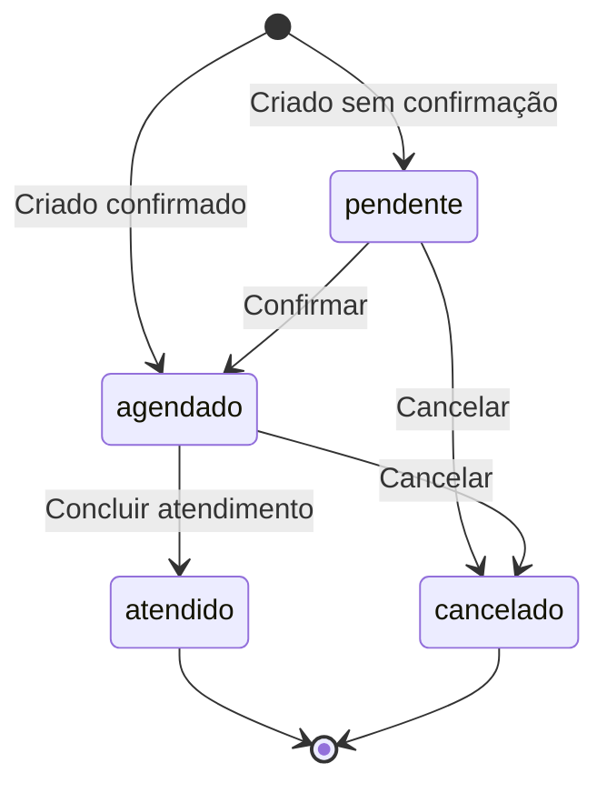
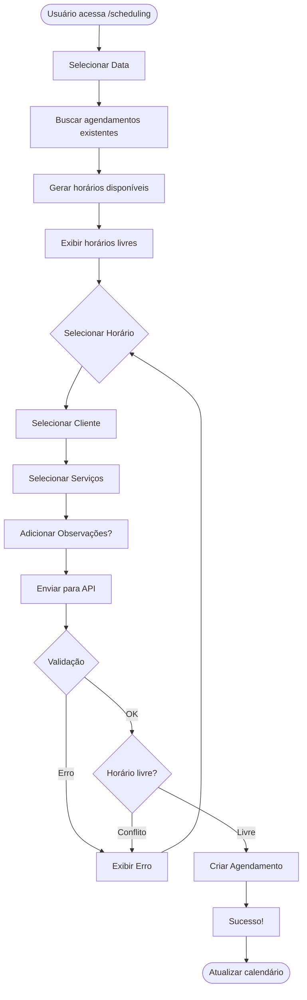
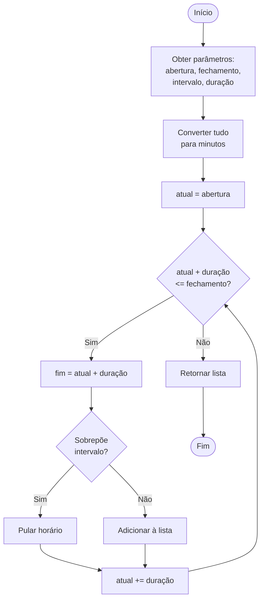

# 📅 Fluxo de Agendamento

Este documento detalha o sistema de agendamento do BarberApp, incluindo lógica de horários dinâmicos, conflitos e gestão de status.

---

## 📋 Índice

- [Visão Geral](#visão-geral)
- [Funcionalidades](#funcionalidades)
- [Lógica de Horários Dinâmicos](#lógica-de-horários-dinâmicos)
- [Criação de Agendamento](#criação-de-agendamento)
- [Gestão de Status](#gestão-de-status)
- [Validações](#validações)
- [Fluxogramas](#fluxogramas)

---

## 🔍 Visão Geral

O sistema de agendamento do BarberApp permite que os profissionais gerenciem seus horários de atendimento de forma inteligente, considerando:

- ✅ Horários de funcionamento da barbearia
- ✅ Intervalos/pausas individuais de cada profissional
- ✅ Duração dos serviços
- ✅ Prevenção de conflitos de horário
- ✅ Múltiplos status de agendamento

---

## ✨ Funcionalidades

### 1. Calendário Interativo

- Visualização mensal de agendamentos
- Seleção de data e horário
- Indicação visual de horários disponíveis/ocupados
- Navegação entre meses

### 2. Agendamento Rápido

- Seleção de cliente (existente ou novo)
- Escolha de serviços múltiplos
- Definição de horário automaticamente disponível
- Observações/descrição opcional

### 3. Gestão de Horários

- Horários dinâmicos baseados em:
  - Abertura/fechamento da barbearia
  - Intervalo do profissional
  - Duração do atendimento
  - Agendamentos existentes

### 4. Status de Agendamento

| Status | Descrição | Cor |
|--------|-----------|-----|
| `agendado` | Confirmado, aguardando atendimento | 🔵 Azul |
| `pendente` | Aguardando confirmação | 🟡 Amarelo |
| `atendido` | Serviço realizado | 🟢 Verde |
| `cancelado` | Cancelado | 🔴 Vermelho |

---

## ⚙️ Lógica de Horários Dinâmicos

### Algoritmo de Geração de Horários

O sistema utiliza a função `gerarHorariosComIntervalo()` para calcular slots disponíveis.

#### Entrada

```typescript
interface HorarioParams {
  horaAbertura: string;      // "09:00"
  horaFechamento: string;    // "19:30"
  duracaoMinutos: number;    // 60 (minutos)
  inicioIntervalo: string;   // "13:00"
  fimIntervalo: string;      // "14:00"
}
```

#### Saída

```typescript
// Array de horários disponíveis
["09:00", "10:00", "11:00", "12:00", "14:00", "15:00", "16:00", "17:00", "18:00"]
```

### Implementação

**Arquivo**: `src/app/app/utils/gerarHorarioDinamico.tsx`

```typescript
export default function gerarHorariosComIntervalo(
  horaAbertura: string,
  horaFechamento: string,
  duracaoMinutos: number,
  inicioIntervalo: string,
  fimIntervalo: string
): string[] {
  // 1. Converter horários para minutos desde 00:00
  const aberturaMin = hhmmParaMinutos(horaAbertura);
  const fechamentoMin = hhmmParaMinutos(horaFechamento);
  const intervaloInicioMin = hhmmParaMinutos(inicioIntervalo);
  const intervaloFimMin = hhmmParaMinutos(fimIntervalo);

  const lista: string[] = [];
  let atual = aberturaMin;

  // 2. Loop: enquanto atendimento cabe antes do fechamento
  while (atual + duracaoMinutos <= fechamentoMin) {
    const fimAtendimento = atual + duracaoMinutos;

    // 3. Verificar sobreposição com intervalo de descanso
    const sobrepoeIntervalo =
      atual < intervaloFimMin && fimAtendimento > intervaloInicioMin;

    // 4. Se não sobrepõe, horário é válido
    if (!sobrepoeIntervalo) {
      lista.push(minutosParaHhmm(atual));
    }

    // 5. Avançar para próximo bloco
    atual += duracaoMinutos;
  }

  return lista;
}

// Funções auxiliares
function hhmmParaMinutos(hhmm: string): number {
  const [h, m] = hhmm.split(":").map(parte => parseInt(parte, 10));
  return h * 60 + m;
}

function minutosParaHhmm(totalMinutos: number): string {
  const horas = Math.floor(totalMinutos / 60);
  const minutos = totalMinutos % 60;
  const hh = String(horas).padStart(2, "0");
  const mm = String(minutos).padStart(2, "0");
  return `${hh}:${mm}`;
}
```

### Exemplo de Uso

```typescript
// Barbearia: 09:00 - 19:30
// Atendimento: 60 minutos
// Pausa: 13:00 - 14:00

const horarios = gerarHorariosComIntervalo(
  "09:00",  // Abertura
  "19:30",  // Fechamento
  60,       // Duração (minutos)
  "13:00",  // Início intervalo
  "14:00"   // Fim intervalo
);

console.log(horarios);
// ["09:00", "10:00", "11:00", "12:00", "14:00", "15:00", "16:00", "17:00", "18:00"]
```

### Regras de Negócio

1. **Horário deve caber completo**
   - Se fechamento for 19:30 e duração 60min, último slot é 18:30
   - Assim, o atendimento termina exatamente às 19:30

2. **Intervalo bloqueia completamente**
   - Agendamento não pode começar antes do fim do intervalo E terminar depois do início
   - Evita sobreposição parcial

3. **Horários em blocos fixos**
   - Se duração é 60min, slots são de hora em hora
   - Se duração é 45min, slots são a cada 45 minutos

---

## 📝 Criação de Agendamento

### API Endpoint

**POST** `/api/createScheduling`

#### Request Body

```typescript
{
  "scheduling": {
    "customer": {
      "id": "67890abc...",      // ID do cliente
      "name": "João Silva"
    },
    "user": {
      "id": "12345def...",      // ID do profissional
      "barbershop": {
        "id": "98765ghi..."     // ID da barbearia
      }
    },
    "date": "2025-01-20",       // Data (YYYY-MM-DD)
    "time": "14:30",            // Horário (HH:mm)
    "servicesTypes": [          // Serviços planejados
      {
        "name": "Corte Masculino",
        "value": 35.00
      },
      {
        "name": "Barba",
        "value": 25.00
      }
    ],
    "description": "Cliente prefere máquina 2mm"  // Opcional
  }
}
```

#### Response (Success)

```json
{
  "message": "New scheduling inserted",
  "newScheduling": {
    "id": "scheduling_id_123",
    "dateTime": "2025-01-20T14:30:00.000Z",
    "date": "2025-01-20",
    "time": "14:30",
    "status": "agendado",
    "wasAttended": false,
    "customerId": "67890abc...",
    "userId": "12345def...",
    "barbershopId": "98765ghi...",
    "servicesTypes": [...],
    "description": "Cliente prefere máquina 2mm"
  }
}
```

### Validações no Backend

**Arquivo**: `src/app/api/createScheduling/route.ts`

```typescript
export async function POST(req: NextRequest) {
  const { scheduling } = await req.json();

  // 1. Validar cliente
  if (!scheduling.customer) {
    return NextResponse.json(
      { message: "É necessário informar um cliente." },
      { status: 400 }
    );
  }

  // 2. Validar serviços
  if (
    scheduling.servicesTypes.length === 1 &&
    scheduling.servicesTypes[0].name === "Selecione"
  ) {
    return NextResponse.json(
      { message: "É necessário informar um serviço." },
      { status: 400 }
    );
  }

  // 3. Validar horário
  if (!scheduling.time) {
    return NextResponse.json(
      { message: "É necessário informar o horário." },
      { status: 400 }
    );
  }

  // 4. Validar profissional
  if (!scheduling.user.id) {
    return NextResponse.json(
      { message: "É necessário informar o usuário." },
      { status: 400 }
    );
  }

  // 5. Criar datetime único (prevenir conflitos)
  const [ano, mes, dia] = date.split("-");
  const isoDate = `${ano}-${mes.padStart(2, "0")}-${dia.padStart(2, "0")}`;
  const concatenated = `${isoDate}T${time}:00.000Z`;

  // 6. Criar agendamento
  const newScheduling = await prisma.scheduling.create({
    data: {
      dateTime: concatenated,  // Campo ÚNICO no schema
      date,
      time,
      status: "agendado",
      barbershop: { connect: { id: user.barbershop.id } },
      customer: { connect: { id: customer.id } },
      user: { connect: { id: user.id } },
      servicesTypes,
      description
    }
  });

  return NextResponse.json({ newScheduling }, { status: 200 });
}
```

### Prevenção de Conflitos

O campo `dateTime` no schema é **UNIQUE**:

```prisma
model Scheduling {
  dateTime DateTime @unique  // Garante que não haja duplicatas
}
```

**Comportamento**:
- Se tentar criar agendamento no mesmo `dateTime`, Prisma lançará erro
- Frontend deve consultar horários ocupados antes de permitir seleção

---

## 🔄 Gestão de Status

### Ciclo de Vida de um Agendamento



### Transições de Status

#### 1. Criar Agendamento

```typescript
// Status inicial: agendado
const scheduling = await prisma.scheduling.create({
  data: {
    ...data,
    status: "agendado",
    wasAttended: false
  }
});
```

#### 2. Marcar como Atendido

```typescript
const updated = await prisma.scheduling.update({
  where: { id: schedulingId },
  data: {
    status: "atendido",
    wasAttended: true
  }
});
```

#### 3. Cancelar Agendamento

```typescript
const cancelled = await prisma.scheduling.update({
  where: { id: schedulingId },
  data: {
    status: "cancelado"
  }
});
```

### Regras de Status

| Status Atual | Pode Alterar Para | Ação |
|--------------|-------------------|------|
| `pendente` | `agendado`, `cancelado` | Confirmar ou Cancelar |
| `agendado` | `atendido`, `cancelado` | Concluir ou Cancelar |
| `atendido` | - | **Final** (não pode alterar) |
| `cancelado` | - | **Final** (não pode alterar) |

---

## ✅ Validações

### Frontend

```typescript
// Validação antes de enviar
const validateScheduling = (data: SchedulingData) => {
  if (!data.customer) {
    throw new Error("Selecione um cliente");
  }
  
  if (!data.servicesTypes || data.servicesTypes.length === 0) {
    throw new Error("Selecione pelo menos um serviço");
  }
  
  if (!data.time) {
    throw new Error("Selecione um horário");
  }
  
  if (!data.date) {
    throw new Error("Selecione uma data");
  }
};
```

### Backend

- ✅ Cliente obrigatório
- ✅ Serviço obrigatório (não pode ser "Selecione")
- ✅ Horário obrigatório
- ✅ Profissional obrigatório
- ✅ Data válida
- ✅ Conflito de horário (via unique constraint)

---

## 📊 Fluxogramas

### Fluxo de Criação de Agendamento



### Algoritmo de Horários Disponíveis



---

## 🔮 Melhorias Futuras

### 1. Notificações Automáticas

- [ ] WhatsApp 24h antes do agendamento
- [ ] SMS de confirmação
- [ ] Email com resumo

### 2. Agendamento Online

- [ ] Link público para clientes agendarem
- [ ] Integração com Google Calendar
- [ ] Confirmação via link

### 3. Lista de Espera

- [ ] Cadastro em lista de espera para horários ocupados
- [ ] Notificação automática em caso de cancelamento

### 4. Reagendamento

- [ ] Permitir alterar horário de agendamentos existentes
- [ ] Histórico de alterações

### 5. Recorrência

- [ ] Agendamentos recorrentes (semanal, quinzenal, mensal)
- [ ] Clientes VIP com horário fixo

---

## 📚 APIs Relacionadas

### Endpoints de Agendamento

| Método | Endpoint | Descrição |
|--------|----------|-----------|
| POST | `/api/createScheduling` | Criar novo agendamento |
| GET | `/api/getUserSchedulings?userId=...` | Listar agendamentos de um profissional |
| PUT | `/api/updateScheduling` | Atualizar status/dados (planejado) |
| DELETE | `/api/deleteScheduling` | Cancelar agendamento (planejado) |

---

## 🎯 Métricas e KPIs

### Métricas de Agendamento

- **Taxa de Ocupação**: % de horários preenchidos
- **Taxa de Cancelamento**: % de agendamentos cancelados
- **No-shows**: Agendados mas não atendidos
- **Horários de pico**: Horários mais agendados

### Exemplos de Queries

```typescript
// Taxa de ocupação
const totalSlots = generatedSlots.length;
const occupiedSlots = await prisma.scheduling.count({
  where: {
    userId,
    date,
    status: { not: "cancelado" }
  }
});
const occupancyRate = (occupiedSlots / totalSlots) * 100;

// Taxa de no-show
const noShows = await prisma.scheduling.count({
  where: {
    userId,
    status: "agendado",
    dateTime: { lt: new Date() }, // Passou o horário
    wasAttended: false
  }
});
```

---

<div align="center">

**[⬆ Voltar ao topo](#-fluxo-de-agendamento)**

</div>
